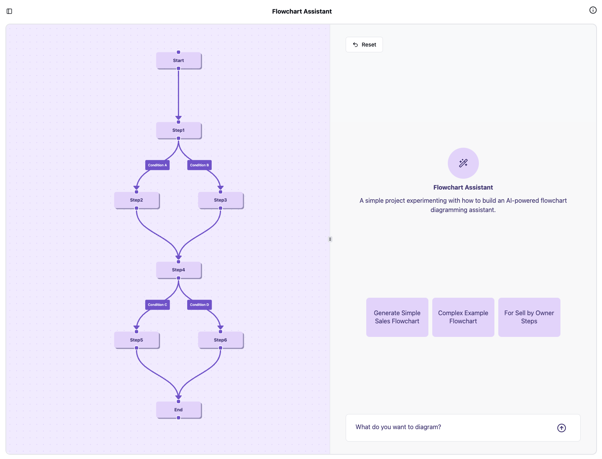

# AI Flowchart Assistant
A simple project experimenting with how to build an AI-powered flowchart diagramming assistant.



## Overview
This project showcases basic integration between an AI model and flowchart tools, allowing a focused space to experiment with prompting for diagram generation, then modification.

## Features
	•	[x] Basic natural language parsing for generating flowchart
	•	[x] Simple node and connection creation
	•	[x] Minimal SVG-based diagram rendering
	•	[x] Demo implementation using mermaid.js or similar library
	•	[X] Example prompts and responses
	•	[ ] Login to save and revisit previous chart chats
	•	[ ] Natural language commands to manipulate diagram details
	•	[ ] Select nodes and prompt diagram changes
	•	[ ] Voice input to generate and manipulate diagrams
	•	[ ] Convert process diagram into tiny step-by-step apps

## To run this project locally
These are very high-level steps, not-complete YMMV. The backend is relatively simple, the complexity is more on the frontend (if you try to run it, let me know if you have any issues)
```
pnpm install --global nx
pnpm install
nx build flow-client
docker-compose up
```
